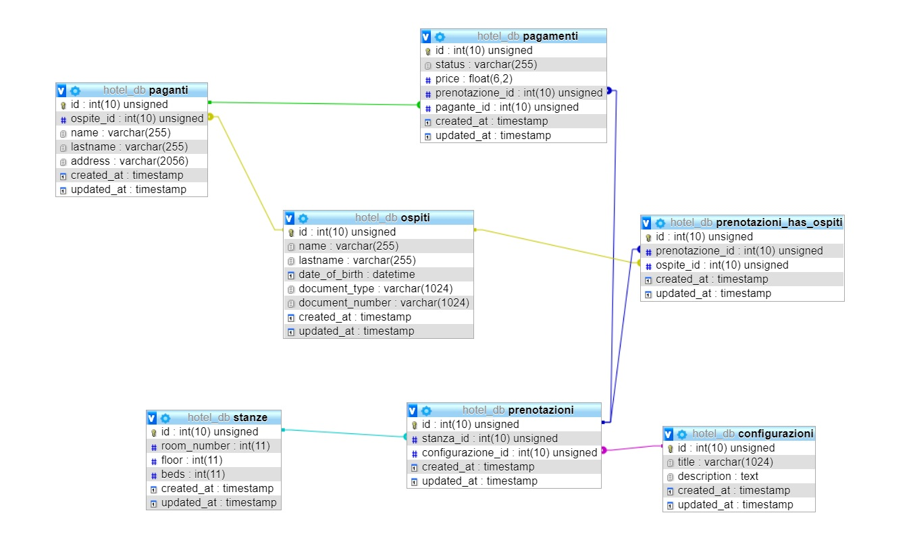

# Db-hotel
SQL exercises using the database of a hotel.

### Database:


### Basic:
1. Seleziona tutti gli ospiti che sono stati identificati con la carta di identità / Select all guests who have been identified with the ID card
```
SELECT `name`,`lastname`,`document_type` FROM `ospiti`
WHERE `document_type` = 'CI'
```
2. Seleziona tutti gli ospiti che sono nati dopo il 1988 / Select all guests who are born after 1988
```
SELECT `name`,`lastname`,`date_of_birth` FROM `ospiti`
WHERE `date_of_birth` > '1988'
```

3. Seleziona tutti gli ospiti che hanno più di 20 anni (al momento dell’esecuzione della query) / Select all guests over 20 years old (at the time of query execution)
```
SELECT `name`,`lastname`,`date_of_birth` FROM `ospiti`
WHERE `date_of_birth` < '2000-05'
```
4. Seleziona tutti gli ospiti il cui nome inizia con la D / Select all guests whose name begins with D
```
SELECT `name`,`lastname` FROM `ospiti`
WHERE `name` LIKE 'D%'
```
5. Calcola il totale degli ordini accepted / Calculate the total accepted orders
```
SELECT COUNT(`id`) as `numero ordini accepted` FROM `pagamenti`
WHERE `status` = 'accepted'
```
6. Qual è il prezzo massimo pagato? / What is the maximum price paid?
```
SELECT MAX(`price`) FROM `pagamenti`
```

7. Seleziona gli ospiti riconosciuti con patente e nati nel 1975 / Select guests recognized with a license and born in 1975
```
SELECT `name`,`lastname` FROM `ospiti`
WHERE `document_type` = 'Driver License'
AND `date_of_birth` LIKE '1975%'
```

8. Quanti posti letto ha l’hotel in totale? / How many beds does the hotel have in total?
```
SELECT SUM(`beds`) as `numero letti totale` FROM `stanze`
```

### Group By:

1. Conta gli ospiti raggruppandoli per anno di nascita / Count guests by year of birth
```
SELECT YEAR(`date_of_birth`) AS `anno di nascita`, COUNT(`id`) AS `numero nascite`
FROM `ospiti`
GROUP BY `anno di nascita`
```
2. Somma i prezzi dei pagamenti raggruppandoli per status / Sum up the prices of payments by status
```
SELECT SUM(`price`), `status`
FROM `pagamenti`
GROUP BY `status`
```
3. Conta quante volte è stata prenotata ogni stanza / Count how many times each room has been booked
```
SELECT COUNT(`id`), `stanza_id`
FROM `prenotazioni`
GROUP BY `stanza_id`
```
4. Fai una analisi per vedere se ci sono ore in cui le prenotazioni sono più frequenti / Do an analysis to see if there are hours when bookings are more frequent
```
SELECT HOUR(`created_at`) AS `ora prenotazione`, COUNT(`id`) AS `numero prenotazioni`
FROM `prenotazioni`
GROUP BY `ora prenotazione`
ORDER BY `numero prenotazioni` DESC
```
5. Quante prenotazioni ha fatto l’ospite che ha fatto più prenotazioni? / How many reservations did the guest who made the most reservations?
```
SELECT `ospite_id` AS `ospite`, COUNT(`id`) AS `numero prenotazioni`
FROM `prenotazioni_has_ospiti`
GROUP BY `ospite`
ORDER BY `numero prenotazioni` DESC
```

### Join:

1. Come si chiamano gli ospiti che hanno fatto più di due prenotazioni? / What are the names of guests who have made more than two reservations?
```
SELECT `ospiti`.`name`, COUNT(`prenotazioni_has_ospiti`.`id`) AS `numero prenotazioni`
FROM `prenotazioni_has_ospiti`
INNER JOIN `ospiti`
ON `ospiti`.`id` = `prenotazioni_has_ospiti`.`ospite_id`
GROUP BY `ospiti`.`name`
HAVING `numero prenotazioni` > '2'
```
2. Stampare tutti gli ospiti per ogni prenotazione / Print all guests for each booking
```
SELECT `prenotazioni_has_ospiti`.`id` AS `id prenotazione`, `ospiti`.`name`, `ospiti`.`lastname`
FROM `ospiti`
INNER JOIN `prenotazioni_has_ospiti`
ON `ospiti`.`id` = `prenotazioni_has_ospiti`.`ospite_id`
ORDER BY `id prenotazione`
```
3. Stampare Nome, Cognome, Prezzo e Pagante per tutte le prenotazioni fatte a Maggio 2018 / Print Name, Surname, Price and Payer for all bookings made in May 2018
```
SELECT `prenotazioni_has_ospiti`.`prenotazione_id`, `ospiti`.`name`, `ospiti`.`lastname`, `pagamenti`.`price`, `paganti`.`name`
FROM `prenotazioni_has_ospiti`
INNER JOIN `ospiti`
ON `ospiti`.`id` = `prenotazioni_has_ospiti`.`ospite_id`
INNER JOIN `pagamenti`
ON `pagamenti`.`prenotazione_id` = `prenotazioni_has_ospiti`.`prenotazione_id`
INNER JOIN `paganti`
ON `paganti`.`id` = `pagamenti`.`pagante_id`
INNER JOIN `prenotazioni`
ON `prenotazioni`.`id` = `prenotazioni_has_ospiti`.`prenotazione_id`
WHERE `prenotazioni`.`created_at` LIKE '2018-05%'
```
4. Fai la somma di tutti i prezzi delle prenotazioni per le stanze del primo piano / Add up all booking prices for the rooms on the first floor
```
SELECT SUM(`price`) AS `somma prezzi delle stanze del primo piano`
FROM `pagamenti`
INNER JOIN `prenotazioni`
ON `prenotazioni`.`id` = `pagamenti`.`prenotazione_id`
INNER JOIN `stanze`
ON `stanze`.`id` = `prenotazioni`.`stanza_id`
WHERE `stanze`.`floor` = 1
```
5. Prendi i dati di fatturazione per la prenotazione con id=7 / Get the billing information for the reservation with id=7
```
SELECT `paganti`.`name` AS `nome`, `paganti`.`lastname` AS `cognome`, `paganti`.`address` AS `indirizzo`
FROM `prenotazioni`
INNER JOIN `pagamenti`
ON `pagamenti`.`prenotazione_id` = `prenotazioni`.`id`
INNER JOIN `paganti`
ON `paganti`.`id` = `pagamenti`.`pagante_id`
WHERE `prenotazioni`.`id` = 7
```
6. Le stanze sono state tutte prenotate almeno una volta? (Visualizzare le stanze non ancora prenotate) / Have all the rooms been booked at least once? (View rooms not yet booked)
```
SELECT `room_number` AS `numero stanze non ancora prenotate`
FROM `stanze`
LEFT JOIN `prenotazioni`
ON `stanze`.`id` = `prenotazioni`.`stanza_id`
WHERE `prenotazioni`.`id` IS NULL
```
